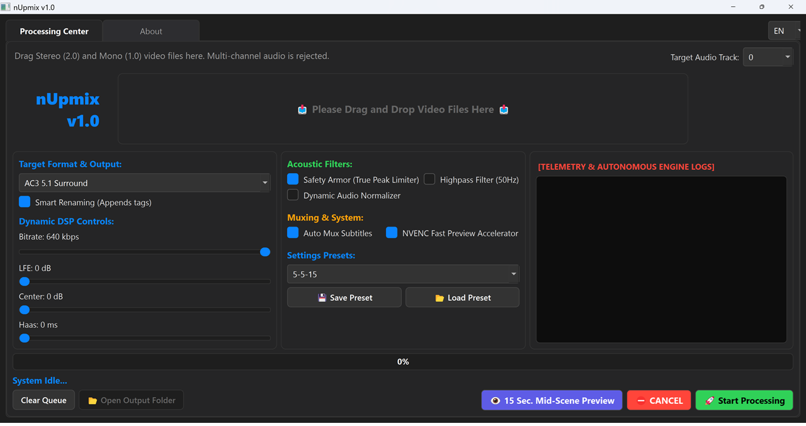

# nUpmix v1.0 Classic – The Acoustic Anchor

🇬🇧 **English** | [🇹🇷 Türkçe](README_TR.md)



> **Autonomous, Hardware-Friendly Acoustic Upmix Engine for Home Theater and Large Media Archives**

---

## 📌 Why nUpmix?

Modern stereo-to-surround conversion workflows often rely on AI source separation models such as Demucs or similar neural networks. While these systems can isolate vocals and instruments surprisingly well, they frequently introduce undesirable artifacts such as synthetic ringing, phase inconsistencies, pumping, and digital smearing.

**nUpmix takes a different path.**

Instead of attempting to reconstruct audio with artificial intelligence, it preserves the integrity of the original recording by relying entirely on **acoustic physics, deterministic phase mathematics, and proven matrix decoding principles.**

The result is a transparent, studio-inspired surround expansion engine designed specifically for:

* 🎬 Home theater enthusiasts
* 📚 Massive movie archives
* 🎵 Legacy stereo and mono recordings
* 🔊 AV receivers that deserve clean, clipping-free audio

No AI hallucinations.

No synthetic reverbs.

No unnecessary processing.

Just clean mathematics.

---

# 🚀 Core Features

## Autonomous Audio Telemetry Engine

Before processing begins, **FFprobe** automatically inspects the source.

nUpmix identifies whether the input is:

* Mono (1.0)
* Stereo (2.0)

The appropriate processing matrix is then selected automatically.

Unsupported or already multichannel sources are rejected, protecting both the processing pipeline and downstream AV equipment from accidental misuse.

---

## True Peak Safety Shield

Modern blockbusters rely on enormous dynamic range.

Quiet whispers...

...followed by explosions.

nUpmix preserves this cinematic dynamic contrast instead of crushing it with aggressive compression.

A transparent **True Peak limiter** (FFmpeg `alimiter`) is applied only when absolutely necessary, trimming peaks above **−0.5 dBFS** while leaving the original dynamics intact.

No pumping.

No loudness war.

Just protection against digital clipping.

---

## A/V Synchronization Shield

Legacy video files often suffer from imperfect frame timing.

To prevent long-term audio drift, the processing chain concludes with:

```text
aresample=48000:async=1000
```

This guarantees reliable synchronization throughout playback.

Output formats are standardized as:

* Dolby Digital AC3 5.1
* AAC Stereo

up to **640 kbps**, ensuring excellent compatibility across virtually all home theater systems.

---

## Intelligent Subtitle Engine

Video streams remain untouched using direct stream copy.

Meanwhile nUpmix automatically detects:

* Embedded subtitles
* External `.srt`
* External `.ass`

For Turkish archives, Turkish subtitles receive automatic:

* Default flag
* Forced flag

allowing media libraries to become immediately ready for viewing without manual remuxing.

---

# 🧮 Acoustic Matrix & Phase Mathematics

Unlike AI upmixers, nUpmix uses carefully designed FFmpeg **pan matrices** to distribute sound according to acoustic principles.

---

# 🎬 5.1 Atmospheric Mode

### (Stereo Sources)

### Front Stage (FL / FR)

The original stereo channels remain **100% untouched.**

Soundstage width, stereo imaging and musical body remain exactly as intended.

---

### Center Channel

### *The Acoustic Anchor*

Dialogue is created from a carefully attenuated **L + R** sum.

Instead of overwhelming the mix, voices become naturally anchored to the screen while preserving the openness of the front stage.

---

### Surround Channels

### *Differential Matrix Shield*

Rear speakers receive the **L − R** differential signal.

This naturally suppresses centered elements such as:

* Lead vocals
* Main dialogue
* Central bass energy

Additional processing includes:

* 300 Hz High-Pass filtering
* Optional Haas delay (10–20 ms)

creating convincing cinematic spaciousness without artificial reverberation.

---

### LFE Channel

Instead of the conservative 80 Hz crossover commonly used elsewhere, nUpmix routes low-frequency energy through a **120 Hz Low-Pass filter**, producing fuller cinematic impact for explosions, engines and large-scale effects.

---

# 🎬 3.1 Purist Mode

### (High Phase Correlation Stereo)

Some stereo recordings contain almost identical left and right channels.

When phase correlation exceeds approximately **95%**, attempting to synthesize surround channels often produces nothing but muddy ambience.

The Autonomous Telemetry Engine detects this condition automatically.

Rather than forcing artificial rear information, nUpmix intelligently switches into **3.1 Purist Mode**, distributing audio only to:

* Front Left
* Front Right
* Center
* LFE

The rear channels remain silent, maximizing clarity and preserving the original recording.

---

# 📺 Modernized 3.1 Sound Wall

### (Mono Sources)

Mono recordings contain no spatial information.

Creating artificial surround effects from pure mono usually results in echo, comb filtering and an unnatural "bathroom" acoustic.

nUpmix refuses to fake spatial information.

Instead, the mono signal is copied equally to:

* Front Left
* Front Right
* Center

forming a massive and stable **Front Sound Wall**.

Rear channels remain completely silent, preserving the honesty and focus of the original recording.

---

# 🎚 Optional Restoration Filters

Classic films often benefit from gentle restoration.

Optional processing modules include:

### Dynamic Loudness Balancer

**DynAudNorm**

Raises quiet dialogue intelligently without destroying the natural dynamics of the soundtrack.

---

### Low Frequency Noise Cutter

A gentle **50 Hz High-Pass filter** removes:

* electrical hum
* HVAC rumble
* infrastructure noise

while leaving dialogue essentially untouched.

---

# ⚙️ Dependencies

Unlike AI upmix solutions, nUpmix requires **no CUDA**, **no GPU inference**, and **no multi-gigabyte neural models.**

Requirements:

* Python 3.x
* PyQt5
* FFmpeg
* FFprobe

Both FFmpeg and FFprobe must be available through the system **PATH**.

---

## NVIDIA Acceleration

When available, **NVENC hardware encoding** is detected automatically for significantly faster preview rendering.

No manual configuration is required.

---

# 🎯 Design Philosophy

nUpmix follows one simple principle:

> **Do not recreate sound.
> Reveal what was already there.**

Every decision in the processing chain favors:

* Transparency
* Phase coherence
* Acoustic realism
* Hardware compatibility
* Deterministic behavior

Instead of asking AI to imagine missing audio, nUpmix lets mathematics preserve the recording's original character.

---

# 👨‍💻 Developer

**nutuzar**
