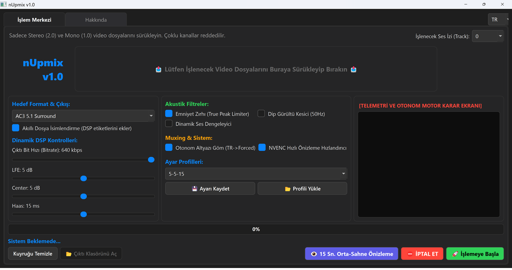

# nUpmix v1.0 Classic – Akustik Çapa

🇹🇷 **Türkçe** | [🇬🇧 English](README.md)



> **Ev Sineması ve Geniş Medya Arşivleri İçin Otonom, Donanım Dostu Akustik Ses Matrisleme Motoru**

---

# 📌 Neden nUpmix?

Günümüzde eski **Stereo (2.0)** veya **Mono (1.0)** kayıtları çok kanallı ses sistemlerine dönüştürmek için sıklıkla yapay zekâ tabanlı kaynak ayırıcılar (Demucs vb.) kullanılmaktadır. Bu yöntemler etkileyici görünse de çoğu zaman istenmeyen yan etkiler üretir:

* Sentetik çınlamalar (artifacts)
* Faz bozulmaları
* Dijital bulanıklık
* Doğallığını kaybetmiş vokaller

**nUpmix farklı bir yaklaşım benimser.**

Sesin eksik olduğunu varsaymaz; onu yeniden üretmeye çalışmaz.

Bunun yerine, tamamen **akustik fizik**, **faz matematiği** ve **deterministik kanal matrisleme** ilkeleriyle çalışarak orijinal kaydın karakterini korur.

Sonuç; ev sineması sistemleri için geliştirilmiş, şeffaf, güvenilir, amfiyi yormayan ve kırpılma (clipping) oluşturmayan doğal bir surround genişletme motorudur.

---

# 🚀 Temel Özellikler

## Otonom Telemetri Motoru

İşleme başlamadan önce **FFprobe** kullanılarak giriş dosyası analiz edilir.

Sistem otomatik olarak kaynağın:

* Mono (1.0)
* Stereo (2.0)

olduğunu belirler ve uygun işleme matrisini kendisi seçer.

Desteklenmeyen veya çok kanallı kaynaklar güvenlik amacıyla reddedilir.

---

## True Peak Emniyet Kalkanı

Sinematik ses tasarımının en önemli özelliklerinden biri geniş dinamik aralıktır.

Fısıltılar...

...ve hemen ardından gelen patlamalar.

nUpmix bu doğal dinamik yapıyı ezmez.

Yalnızca **0 dBFS** seviyesini aşabilecek ani tepe noktalarını önlemek amacıyla **−0.5 dBFS** sınırında şeffaf bir **True Peak Limiter (alimiter)** uygulanır.

Sonuç:

* Dinamikler korunur.
* Gereksiz sıkıştırma uygulanmaz.
* Dijital clipping engellenir.

---

## A/V Senkronizasyon Kalkanı

Eski video kayıtlarında zaman zaman kare hızı (frame rate) kaynaklı ses kaymaları oluşabilir.

İşlem zincirinin sonunda uygulanan:

```text
aresample=48000:async=1000
```

filtresi uzun videolarda oluşabilecek senkron kaymalarını otomatik olarak düzeltir.

Çıktılar sinematik standartlara uygun şekilde üretilir:

* Dolby Digital AC3 5.1
* AAC Stereo

(Maksimum 640 kbps)

---

## Akıllı Altyazı Motoru

Video akışı yeniden kodlanmadan doğrudan kopyalanır.

nUpmix otomatik olarak:

* Gömülü altyazıları
* Harici `.srt`
* Harici `.ass`

dosyalarını algılar.

Türkçe altyazılar otomatik olarak:

* **Default**
* **Forced**

bayraklarıyla işaretlenerek arşivin seyretmeye hazır hale gelmesi sağlanır.

---

# 🧮 Akustik Matris ve Faz Matematiği

nUpmix, FFmpeg'in **pan** filtrelerini kullanarak sesi tamamen fiziksel kurallara göre yönlendirir.

---

# 🎬 5.1 Atmosferik Mod

### (Stereo Kaynaklar)

## Ön Sahne (FL / FR)

Orijinal stereo kanallar %100 korunur.

Ses sahnesinin genişliği, enstrüman yerleşimi ve müzikal denge değiştirilmez.

---

## Merkez Kanal

### Acoustic Anchor

Merkez kanal, zayıflatılmış **L + R** toplamından oluşturulur.

Böylece diyaloglar ses seviyesini şişirmeden fiziksel olarak ekranın merkezine sabitlenir.

---

## Arka Kanallar

### Diferansiyel Faz Matrisi

Surround kanallar **L − R** fark sinyalinden üretilir.

Bu yöntem sayesinde:

* Diyaloglar
* Merkez vokaller
* Ana bas

arka hoparlörlere taşınmaz.

Ek olarak:

* 300 Hz High-Pass filtresi uygulanır.
* İstenirse 10–20 ms Haas gecikmesi eklenebilir.

Sonuç, yapay yankı yerine doğal mekânsal genişliktir.

---

## LFE (Subwoofer)

Düşük frekanslar 120 Hz Low-Pass filtresiyle işlenerek patlamalara, motor seslerine ve sinematik efektlere güçlü ancak temiz bir gövde kazandırılır.

---

# 🎬 3.1 Purist Mod

### (Yüksek Faz Korelasyonlu Stereo)

Bazı stereo kayıtların sağ ve sol kanalları neredeyse aynıdır.

Faz korelasyonu yaklaşık %95'in üzerine çıktığında surround üretmeye çalışmak çoğu zaman yalnızca bulanık bir yankı oluşturur.

nUpmix bunu otomatik olarak tespit eder.

Yapay surround üretmek yerine sistemi **3.1 Purist Mod**'a geçirir.

Ses yalnızca:

* FL
* FR
* Center
* LFE

kanallarına dağıtılır.

Arka hoparlörler tamamen sessiz bırakılarak maksimum netlik korunur.

---

# 📺 Modernize 3.1 Ses Duvarı

### (Mono Kaynaklar)

Mono kayıtlar yön bilgisi içermez.

Bu nedenle yapay surround üretmek yerine mono sinyal doğrudan:

* FL
* FR
* Center

kanallarına kopyalanır.

Ortaya geniş, güçlü ve kararlı bir ön ses sahnesi çıkar.

Arka hoparlörler bilinçli olarak sessiz bırakılır.

Çünkü olmayan bir mekânsal bilgiyi üretmeye çalışmak yerine, mevcut kaydı en doğal hâliyle sunmak daha doğrudur.

---

# 🎚 İsteğe Bağlı Restorasyon Filtreleri

Eski film arşivleri için isteğe bağlı iki ek filtre sunulur.

## Dinamik Ses Dengeleyici (DynAudNorm)

Sessiz diyalogları yükseltirken filmin doğal dinamik yapısını korur.

---

## 50 Hz Dip Gürültü Kesici

Elektrik uğultusu, altyapı gürültüsü ve düşük frekanslı titreşimleri temizler.

Konuşma netliği korunurken gereksiz dip sesler azaltılır.

---

# ⚙️ Gereksinimler

nUpmix;

* CUDA gerektirmez.
* PyTorch modelleri gerektirmez.
* Yapay zekâ modeli indirmez.
* Gigabaytlarca veri kullanmaz.

İhtiyaç duyduğu bileşenler:

* Python 3.x
* PyQt5
* FFmpeg
* FFprobe

FFmpeg ve FFprobe sistemin **PATH** değişkenine eklenmiş olmalıdır.

---

## NVIDIA Donanım Hızlandırması

Sistem destekliyorsa **NVENC** otomatik olarak algılanır ve önizleme işlemlerinde donanımsal hızlandırma kullanılır.

Herhangi bir ek yapılandırma gerekmez.

---

# 🎯 Tasarım Felsefesi

nUpmix tek bir ilkeye inanır:

> **Ses yeniden yaratılmaz.
> Zaten var olan doğru şekilde ortaya çıkarılır.**

Bu nedenle tüm işleme zinciri şu değerlere öncelik verir:

* Akustik doğruluk
* Faz bütünlüğü
* Şeffaf işleme
* Donanım uyumluluğu
* Deterministik çalışma
* Orijinal kayda sadakat

Yapay zekânın sesi tahmin etmesini beklemek yerine, matematiğin sesi korumasına güvenilir.

---

# 👨‍💻 Geliştirici

**nutuzar**
